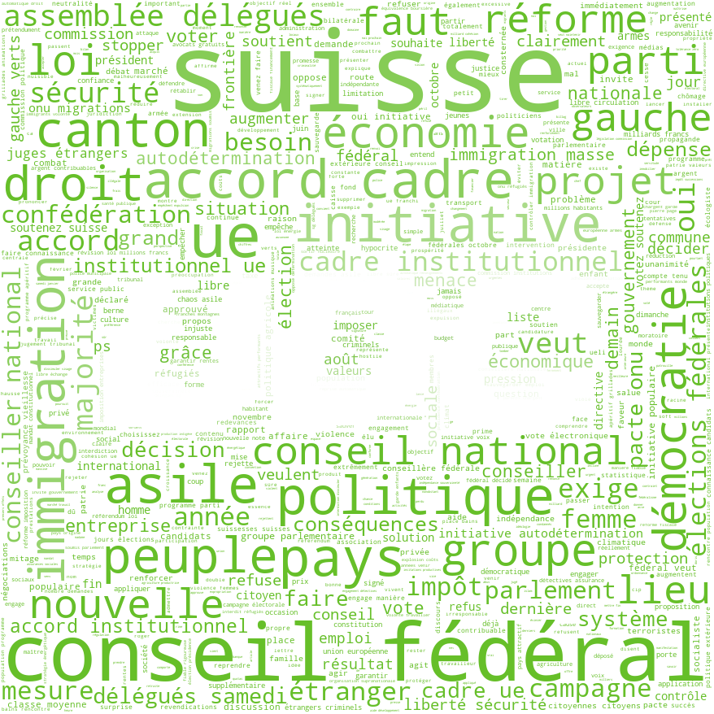
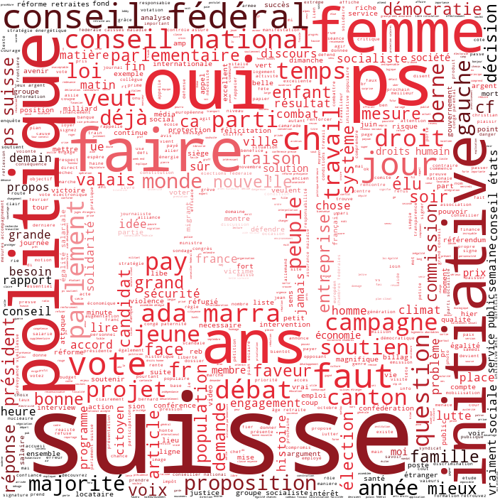
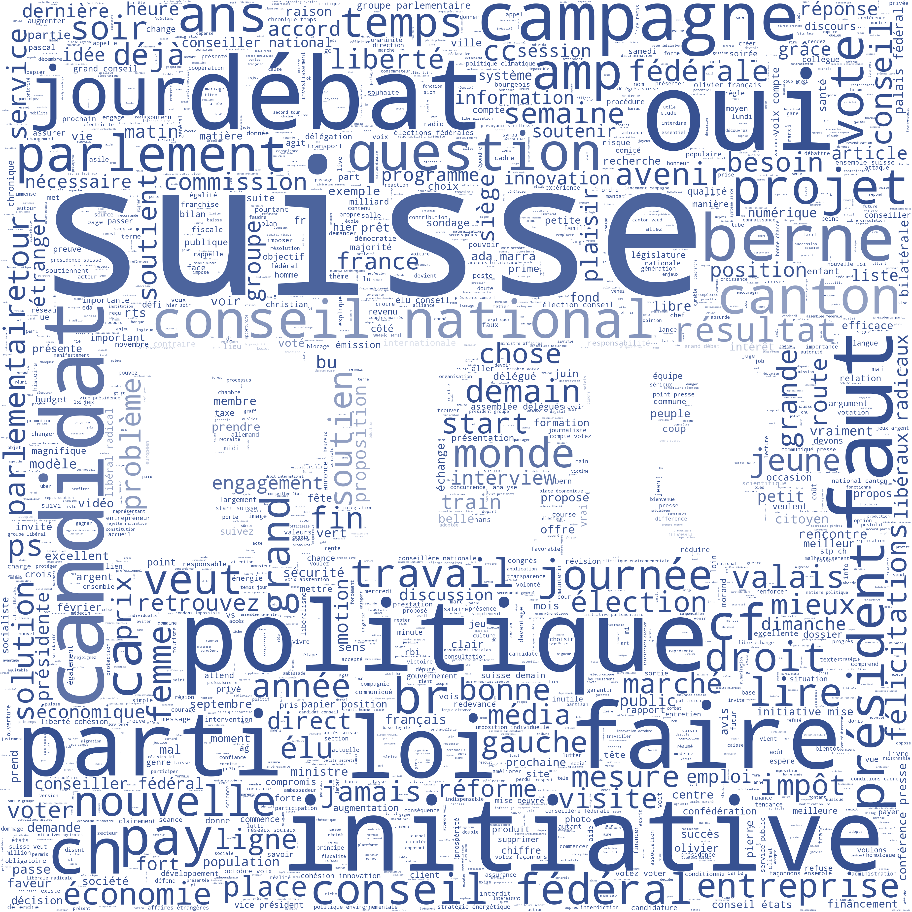
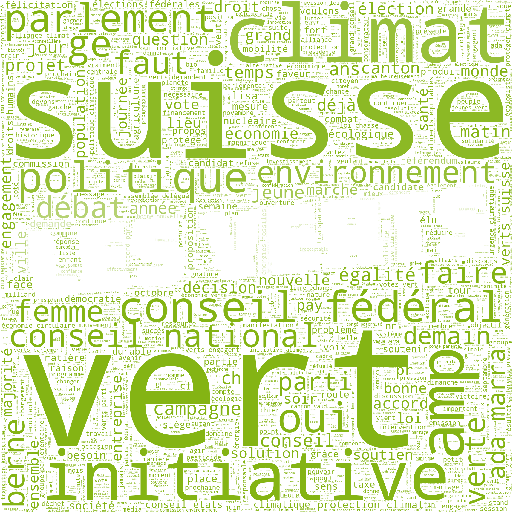
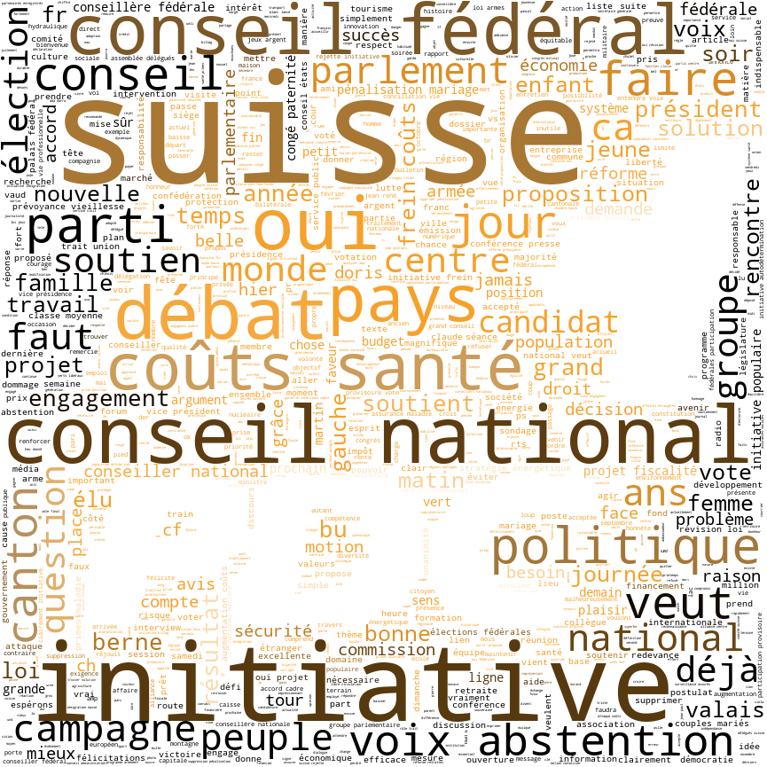
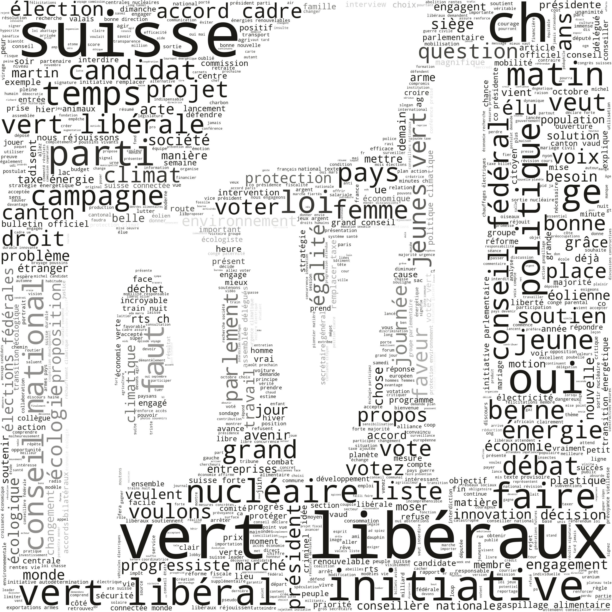

# Abstract:
In October 2019, the <b>Swiss federal elections</b> took place and led to a huge paradigm shift. Almost all the parties started talking about climate change and the two Swiss green parties increased considerably their numbers of representatives into
the parliament. This phenomenon has been called the <b><i>Green Wave</i></b>, and has been designated <a href="https://www.rts.ch/info/culture/10916700-en-suisse-romande-vague-verte-choisie-comme-expression-de-l-annee.html">expression of the year</a>
in Romandy. Through this data story, we aim to better understand how the different <b>Swiss political parties</b> communicate their ideas to the public, e.g., what are the keywords and topics they address the most. We concentrate on the six largest
parties of the last elections and observe if there is any <b>change in their communication</b> over the years and if so, if it has a relationship with the results of the federal elections.

# Introduction:

Twitter is became a central medium of communication and is used by most of the politicians to transmit their ideas. The restriction of 280 characters by tweet forces the politicians to be succinct and to compress their ideas to keep only the
essential, using often the same recurrent keywords. It provides for us a good way to grasp what topics are mainly addressed by each party and politician. Therefore, we analyze <b>163,186 tweets</b> posted by the sixth largest parties (listed below)
and some of their members (selected by their <a href="https://www.tagesanzeiger.ch/sonntagszeitung/wer-hat-in-bern-am-meisten-einfluss/story/11893481">influence</a> in the parliament). We also use the archives of the Radio Television of Switzerland
(<b>RTS</b>) to understand what are the principal topics discussed by the politicians over the years. Finally, we compare the changes in communications of the parties with the <b>results of the federal</b> elections using the associated datasets.

# Swiss parties you said ?

To familiarize with political parties of Switzerland, we propose first a small introduction about them, with the most used words in their tweets (members and parties tweets aggregated):

    

        

            
        

        

            

                <h2> UDC </h2>
                The Swiss People’s party (Union Démocratique du Centre in French) is a national-conservative, <b>right-wing</b> populist party. It’s the party with the more members in the Swiss parliament. They fight
                for the preservation of Switzerland's political sovereignty (they are Eurosceptic) and are against mass immigration by making the asylum laws stricter. The party opposes governmental measures for environmental protection.
            

        

    

 

    

        

            

                <h2> PS </h2>
                The Social Democratic Party of Switzerland or Socialist party (Parti Socialiste Suisse in French) is a socialist, progressive and <b>Centre-left</b> party. It’s the second strongest party in Switzerland. They are in favor of strong
                public services, environmental policy with climate change mitigation and social equity in an open society. The party is against policies of economic liberalization such as deregulation and capitalism.
            

        

        

            
        

    

 

    

        

            
        

        

            

                <h2> PLR </h2>
                The Liberals (Parti Libéral-radical in French) is a liberal and <b>right-wing</b> party. It’s the third largest party in the Swiss parliament. They call themselves the party of the economy and promote individual responsibility. The
                party believes that an open society and economic freedom are more conducive to prosperity, rather than a redistributive and regulative state.
            

        

    

 

    

        

            

                <h2> Les VERTS </h2>
                The green Party of Switzerland (Les Verts in French) is a environmentalist, progressive and <b>left-wing</b> party. It’s the fourth-largest party in Switzerland. Their main concerns are the protection of the environment and the fight
                against climate change. The party is often allied with the Socialist Party, sharing common values such as social equity and strong public services.
            

        

        

            
        

    

 

    

        

            
        

        

            

                <h2> PDC </h2>
                The Christian Democratic People’s party of Switzerland (Parti Démocrate-Chrétien in French) is a Christian-democratic and <b>centre-right</b> party. It’s the fifth strongest party in Switzerland. They advocate moderate social
                conservatism and social market economy, balance between economic liberalism and social justice. They consider themselves as the link between the left and the right wing.
            

        

    

 

    

        

            

                <h2> PVL </h2>
                The Green Liberal Party of Switzerland (Parti Vert’Libéral in French) is a <b>centre-right</b>, green-liberal party in Switzerland. It’s the youngest and the sixth strongest party in Switzerland. They seek to combine moderate economic
                liberalism with environmental sustainability. The party promotes economic growth, but with the preservation of the environment. They encourage sustainable energy.
            

        

        

            
        

    

# Topics to pick

## Are politicians really all the same ?

The political spectrum is often represented as an axis left-right, with sometimes a second axis from conservative to progressive. It is interesting to figure out how close a party is from another one. To do that, we compute the <b>similarities
    between the different parties</b> by considering the geometrical distances between them.
> Brace yourself, <b>mathematical stuff</b>:  In practice, we associate each word of the tweets to a vector of dimension 100 by looking at the words (the context) around them. Then, we only keep the keywords of our topics and compute the averaged
vector of all the keywords used by a given party. To conclude, we compare the obtained vectors using the cosine similarity.

The following chart represents the similarities between the parties:

We can observe that some results are very close of what we could expect. The left-wing <b>green party is very far from the right-wing UDC party</b>, but nearer from the other left-wing socialist party and the other green (liberal) party.
Surprisingly, <b>the PLR and the PS</b>, which respectively represent the right and the left, <b>are also very close</b>. A non exhaustive interpretation could be the following: both are talking about the same topics but with different and opposite
opinions.

# The usual suspects

Without any surprise, the top tweets from each party are well representative of their ideology.
The followers of the page will tend to retweet or follow posts which confirm the best their beliefs.
Confirming our topic analysis, we can see that UDC talks about immigration, PS talks about refusing
payments from private corporations, PLR about individualism and work, les VERTS about climate, PDC
about healthcare and PVL about climate, entrepreneurship and youth.

    

        

            

                <blockquote class="twitter-tweet" data-cards="hidden" data-lang="en">
                    
                </blockquote>
            

        

        

            

                <blockquote class="twitter-tweet" data-cards="hidden" data-lang="en">
                    
                </blockquote>
            

        

    

     
    

        

            

                <blockquote class="twitter-tweet" data-cards="hidden" data-lang="en">
                    
                </blockquote>
            

        

        

            <blockquote class="twitter-tweet" data-cards="hidden" data-lang="en">
                
            </blockquote>
        

    

     
    

        

            <blockquote class="twitter-tweet" data-cards="hidden" data-lang="en">
                
            </blockquote>
        

        

            <blockquote class="twitter-tweet" data-cards="hidden" data-lang="en">
                
            </blockquote>
        

    

# What ? The party is evolving !

We are interested in how the communication has evolved over the last legislature (2015-2019). Specifically, what are the main topics of each year for the different parties. The following chart represents the evolution of these different topics
<b>over the years</b>.

You can select the party that you wish:
<button id="All">All</button>
<button id="UDC">UDC</button>
<button id="PS">PS</button>
<button id="PLR">PLR</button>
<button id="VERTS">VERTS</button>
<button id="PDC">PDC</button>
<button id="PVL">PVL</button>

Globally, we observe a lot of changes over the years and three are really significant:
<ol>
    <li>The topic of the <b>climate</b> has largely <b>gained</b> in importance during the two past years.</li>
    <li>The theme of the <b>immigration</b> has <b>lost</b> in importance over the last legislature.</li>
    <li>Between 2015 and 2017, the question of the <b>AVS</b> (Assurance-Vieillesse et Survivants) has also considerably <b>grown</b> in importance.</li>
</ol>

These changes could be explained by the actualities e.g., votations, crisis, bombing, etc... We will focus on the first and main change, the climate change. During the past years, all the parties have started talking often about the global warming
and the protection of the environment. The PLR and the PS have respectively <b>increased of approximately 25 and 40 times their communication about the climate</b> (in proportion). About 50% of the communication of the green party in 2019 is also
about the climate, more than the other green (liberal) party, 36%. Thus the <i>Green Wave</i> has submerged until the twittersphere.

You can select the party that you wish:
<button id="UDC-1">UDC</button>
<button id="PS-1">PS</button>
<button id="PLR-1">PLR</button>
<button id="VERTS-1">VERTS</button>
<button id="PDC-1">PDC</button>
<button id="PVL-1">PVL</button>

# The first rule of Swiss Politics ... you don't talk about PVL
On the mainlines we see that parties tend to talk more about more powerful parties and parties from which they are ideologically distant.
Some parties have aliances, so mentions of eachother can be high, as it is the case for les VERTS with PS.
PS being the main opposition to UDC's majority, they adopted a strategy of mentioning (criticizing) UDC, they talk about them nearly 6 times more than other parties combined.
<figure class="highcharts-figure">
    

</figure>
Although one strategy in communication catches the eye: don't mention the Green Liberal party.
<footer style="background-color: #d32f2f">
    

        

            

                

                     
                    Deniz Ira, Isabelle Pumford, Arthur Vignon, Robin Zbinden • 2019
                     
                    <a href="https://github.com/ArthurVignon/ADA_project_RADI"><b>GitHub Repository</b></a>
                    •
                    <a href="https://github.com/alcarinn/alcarinn.github.io"> <b> Website Repository </b> </a>
                     
                    <b>Theme </b>
                    <a href="https://github.com/chibicode/duo">duo</a>
                    <b>by </b>
                    <a href="https://github.com/chibicode">Shu Uesugi</a>
                     
                

            

        

    

</footer>

<a href="https://github.com/ArthurVignon/ADA_project_RADI" class="github-corner"><svg width="80" height="80" viewBox="0 0 250 250" style="fill:#151513; color:#fff; position: absolute; top: 0; border: 0; right: 0;">
        <path d="M0,0 L115,115 L130,115 L142,142 L250,250 L250,0 Z"></path>
        <path d="M128.3,109.0 C113.8,99.7 119.0,89.6 119.0,89.6 C122.0,82.7 120.5,78.6 120.5,78.6 C119.2,72.0 123.4,76.3 123.4,76.3 C127.3,80.9 125.5,87.3 125.5,87.3 C122.9,97.6 130.6,101.9 134.4,103.2" fill="currentColor"
            style="transform-origin: 130px 106px;" class="octo-arm"></path>
        <path
            d="M115.0,115.0 C114.9,115.1 118.7,116.5 119.8,115.4 L133.7,101.6 C136.9,99.2 139.9,98.4 142.2,98.6 C133.8,88.0 127.5,74.4 143.8,58.0 C148.5,53.4 154.0,51.2 159.7,51.0 C160.3,49.4 163.2,43.6 171.4,40.1 C171.4,40.1 176.1,42.5 178.8,56.2 C183.1,58.6 187.2,61.8 190.9,65.4 C194.5,69.0 197.7,73.2 200.1,77.6 C213.8,80.2 216.3,84.9 216.3,84.9 C212.7,93.1 206.9,96.0 205.4,96.6 C205.1,102.4 203.0,107.8 198.3,112.5 C181.9,128.9 168.3,122.5 157.7,114.1 C157.9,116.9 156.7,120.9 152.7,124.9 L141.0,136.5 C139.8,137.7 141.6,141.9 141.8,141.8 Z"
            fill="currentColor" class="octo-body"></path>
    </svg></a>

